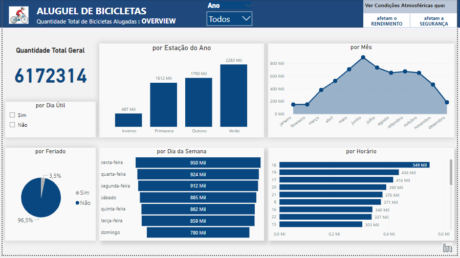
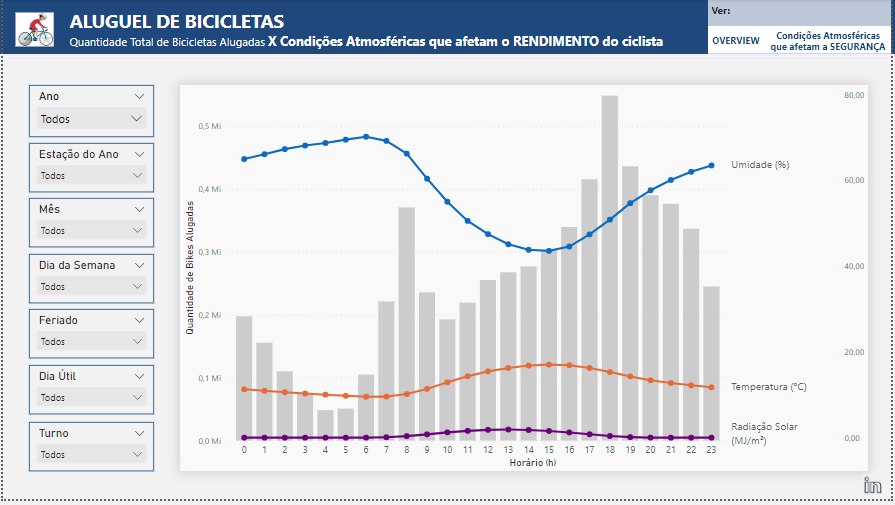
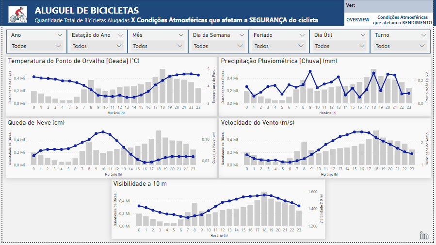

# **Tema: Aluguel de Bicicletas**

Promovido pelo Programa FLAI aos alunos membros. Meu *segundo* dashboard. Minha participação se deu como rico aprendizado, ficando em 11° entre os alunos novos que participaram.

**Detalhes da Competição:** Desenvolvimento de um dashboard (até 3 páginas) que ajudasse na compreensão do negócio (aluguel de bicicletas) e que ajudasse no despertar de ideias que contribuísse com o objetivo, que era aumentar as vendas do serviço de aluguel de bicicletas.

**Critérios de Avaliação:** Qualidade visual do dashboard (design); Pertinência e objetividade das informações apresentadas; e Apresentação do dashboard.

**Dataset:** Dados extraído no kaggle ( https://www.kaggle.com/code/hardikjain10/seoul-bike-rented/data ).

**Submissão:** submetido em 20 de Setembro de 2022.

**Acesso ao painel:** https://bityli.com/AEQUVtvyV
