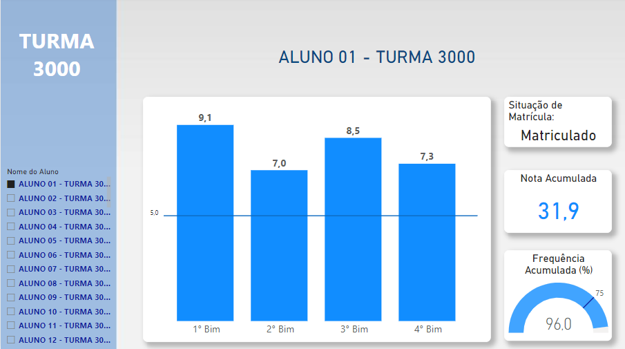

# **Painel de Notas - Matemática**

**Temática envolvida:** Conhecer o rendimento escolar de cada aluno em matemática de uma turma. Se o desempenho foi satisfatório, se houve evolução ou declínio, ou se as notas foram muito oscilantes (em torno da média) ao longo do ano letivo. Se era frequente, ou não, nas aulas. E a situação de matrícula de cada um, na instituição de ensino.

**Problema:** Facilitar a visualização da situação de cada aluno para o professor de uma determinada turma, em uma instituição de ensino.

**Dataset:** Foram extraídos do Docente Online (intranet do site SEEDUC/RJ). Os nomes dos alunos foram omitidos, por sigilo.

**Conclusão:** Com este conjunto de dados transformados em gráficos, facilita o professor em dar seu parecer sobre algum aluno específico de uma determinada turma nas reuniões pedagógicas de conselho de classe, numa instituição de ensino.

**Acesso ao painel:** https://bityli.com/aQvpzYxJb
